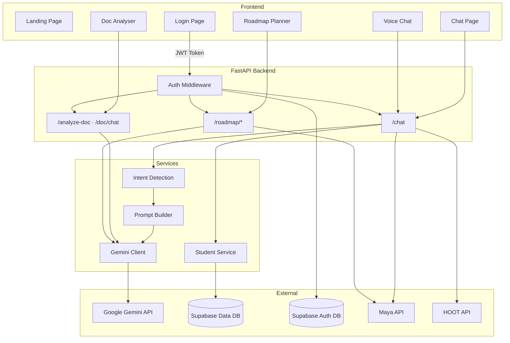
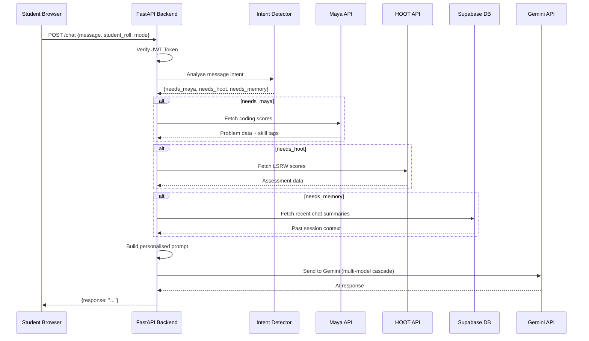

# INTELLMIND — AI Learning Intelligence

> A personalised AI tutoring platform for engineering students — powered by Google Gemini, FastAPI, and Supabase.

INTELLMIND analyses each student's academic profile (coding scores, LSRW assessments, past chat context) to deliver personalised tutoring through text chat, voice chat, document analysis, and AI-generated study roadmaps.

---

## Tech Stack

| Layer        | Technology                          | Purpose                                      |
|--------------|-------------------------------------|----------------------------------------------|
| **Frontend** | HTML5, CSS3, Vanilla JavaScript     | Responsive UI with modular page architecture |
| **Backend**  | Python 3.10+, FastAPI, Uvicorn      | REST API server with async request handling  |
| **AI**       | Google Gemini 2.0 Flash (REST API)  | Multi-modal AI with text + image support     |
| **Database** | Supabase (PostgreSQL + Auth)        | Dual-project: Auth DB + Data DB              |
| **Auth**     | Supabase Auth (JWT)                 | Session-based authentication with JWT tokens |

---

## Architecture



---

## Project Structure

```
intellmind/
├── .gitignore
├── README.md
│
├── frontend/
│   ├── index.html                         # Landing page
│   ├── css/                               # Landing page styles
│   ├── js/                                # Landing page scripts
│   │
│   ├── shared/                            # Shared resources across all pages
│   │   ├── css/
│   │   │   ├── variables.css              # Design tokens (colors, fonts, spacing)
│   │   │   ├── reset.css                  # CSS reset / normalisation
│   │   │   └── topbar.css                 # Common navigation bar
│   │   └── js/
│   │       ├── auth.js                    # Session guard + sign-out + dropdown
│   │       ├── config.js                  # API base URL (dev vs production)
│   │       ├── markdown.js                # Markdown → HTML renderer with syntax highlighting
│   │       ├── security.js                # Anti-inspection shield (right-click, devtools)
│   │       └── toast.js                   # Toast notification system
│   │
│   ├── login/                             # Authentication page
│   │   ├── index.html
│   │   ├── css/
│   │   └── js/
│   │       ├── env.js                     # Frontend environment config
│   │       ├── supabaseClient.js          # Dual Supabase client initialisation
│   │       ├── authService.js             # Login/logout logic + session storage
│   │       └── login.js                   # Form UI controller + validation
│   │
│   ├── chat/                              # AI Text Chat
│   │   ├── index.html
│   │   ├── css/
│   │   └── js/chat.js                     # Chat logic with image upload support
│   │
│   ├── voice/                             # AI Voice Chat
│   │   ├── index.html
│   │   ├── css/
│   │   └── js/voice.js                    # Speech recognition + TTS + auto-listen
│   │
│   ├── doc/                               # Document Analyser
│   │   ├── index.html
│   │   ├── css/
│   │   └── js/doc.js                      # Upload → analysis → split-view chat
│   │
│   └── roadmap/                           # Roadmap Planner
│       ├── index.html
│       ├── css/
│       └── js/roadmap.js                  # Plan generation + task tracking
│
└── backend/
    ├── main.py                            # FastAPI app entry point + CORS + routers
    ├── requirements.txt                   # Python dependencies
    ├── .env.example                       # Environment variable template
    ├── .gitignore
    │
    └── app/
        ├── config.py                      # Centralised env var loader
        ├── db.py                          # Dual Supabase client (Auth + Data)
        ├── auth.py                        # JWT verification middleware
        │
        ├── routes/
        │   ├── chat.py                    # POST /chat — AI tutor with intent detection
        │   ├── doc.py                     # POST /analyze-doc, POST /doc/chat
        │   └── roadmap.py                 # /roadmap/* — study plan CRUD
        │
        └── services/
            ├── gemini.py                  # Gemini API client (multi-model cascade)
            ├── intent.py                  # NLP-based intent classifier
            ├── prompts.py                 # Prompt templates (chat/voice/roadmap)
            ├── student_service.py         # Student data queries (Supabase)
            ├── maya_service.py            # Maya platform API integration
            ├── hoot_data.py               # HOOT LSRW assessment data
            ├── summarizer.py              # Chat session summarizer + scorer
            └── recommender.py             # Study topic recommendation engine
```

---

## Key Features

### 1. AI Text Chat (`/chat`)
- **Smart Intent Detection** — Analyses each query to determine which data sources are needed (Maya scores, HOOT assessments, chat history), fetching only what's relevant to minimize token usage and latency.
- **Multi-Modal Input** — Supports image uploads alongside text (screenshots of code, diagrams, handwritten notes).
- **Personalised Context** — Each prompt is enriched with the student's real academic data from Maya and HOOT platforms.
- **Session Memory** — Chat summaries are persisted to Supabase for long-term context recall.

### 2. AI Voice Chat (`/voice`)
- **Speech-to-Text** — Web Speech API with silence detection and auto-stop.
- **Text-to-Speech** — Chrome TTS with keepalive workaround (prevents 15s auto-pause bug), markdown stripping, and voice prioritisation.
- **Hands-Free Mode** — Auto-listen after bot finishes speaking, with retry guard to prevent infinite loops.
- **Browser Compatibility** — Startup detection with clear user messaging for unsupported browsers.

### 3. Document Analyser (`/analyze-doc`, `/doc/chat`)
- **Multi-Format Support** — Accepts PDF (PyMuPDF), DOCX (python-docx), TXT, MD, and CSV.
- **Three-Panel Workspace** — Analysis view, full-screen chat, and split-view (document + chat side-by-side).
- **Session-Based Context** — Full document text is stored server-side and injected into every follow-up prompt for accurate Q&A.

### 4. Roadmap Planner (`/roadmap/*`)
- **AI-Generated Study Plans** — Gemini creates personalised day-by-day study plans based on Maya performance data.
- **Configurable Duration** — 7, 15, 21, or 30-day plans.
- **Progress Tracking** — Mark tasks as complete, view today's task, track completion percentage.
- **Usage Limits** — Max 3 plans per month; must complete active plan before generating a new one.

---

## System Flow — Chat Pipeline



---

## API Reference

| Method | Endpoint                              | Auth | Description                                  |
|--------|---------------------------------------|------|----------------------------------------------|
| POST   | `/chat`                               | JWT  | AI tutoring with intent-based data fetching  |
| POST   | `/analyze-doc`                        | JWT  | Upload document → AI analysis + session_id   |
| POST   | `/doc/chat`                           | JWT  | Follow-up Q&A about an uploaded document     |
| POST   | `/roadmap/generate`                   | JWT  | Generate AI study plan (max 3/month)         |
| GET    | `/roadmap/plans/{roll}`               | JWT  | List all plans for a student                 |
| PATCH  | `/roadmap/plans/{plan_id}/activate`   | JWT  | Set a plan as the active plan                |
| PATCH  | `/roadmap/tasks/{task_id}/complete`   | JWT  | Mark a specific task as done                 |
| GET    | `/roadmap/active/{roll}`              | JWT  | Get active plan + today's task               |

---

## Database Schema (Supabase)

### Data DB — Student Records & Plans

| Table           | Key Columns                                                        | Purpose                     |
|-----------------|--------------------------------------------------------------------|-----------------------------|
| `chat_summary`  | `user_id`, `topics[]`, `strengths[]`, `weaknesses[]`, `score`      | Persisted chat session data |
| `study_plans`   | `student_roll`, `title`, `duration_days`, `is_active`, `created_at`| Roadmap plan metadata       |
| `plan_tasks`    | `plan_id`, `day_number`, `description`, `status`                   | Individual day tasks        |

### Auth DB — Authentication

| Table           | Purpose                               |
|-----------------|---------------------------------------|
| `auth.users`    | Supabase-managed user accounts (JWT)  |
| `login_logs`    | Login event audit trail               |

---

## Security

| Layer            | Implementation                                                    |
|------------------|-------------------------------------------------------------------|
| **Authentication** | Supabase JWT tokens verified on every API request               |
| **Authorisation**  | `verify_student_roll` ensures users can only access their own data |
| **CORS**           | Whitelist-based origin validation (configurable via env vars)   |
| **Client-Side**    | Anti-inspection shield blocks DevTools, right-click, view-source |
| **Secrets**        | All API keys stored server-side in `.env` — never exposed to browser |

---

## Gemini Integration

INTELLMIND uses a **raw REST integration** with the Gemini API (no SDK), providing:

- **Multi-Model Cascade** — Automatically retries across `gemini-2.0-flash`, `gemini-2.0-flash-lite`, and `gemini-1.5-flash` if the primary model is overloaded.
- **Dual-Layer JSON Parsing** — Handles both structured JSON responses and raw text with regex fallback extraction.
- **Multi-Modal Support** — Accepts text + base64-encoded images in a single request.
- **Rate Limit Resilience** — Exponential backoff with up to 3 retry cycles across models, handling 429 and 503 errors gracefully.

---

## Setup & Run

### Prerequisites
- Python 3.10+
- VS Code with **Live Server** extension (for frontend)
- Supabase project (free tier)
- Google Gemini API key

### 1. Clone the Repository
```bash
git clone https://github.com/your-username/intellmind.git
cd intellmind
```

### 2. Configure Environment Variables
```bash
cd backend
cp .env.example .env
# Edit .env with your actual keys
```

### 3. Install Dependencies & Start Backend
```bash
pip install -r requirements.txt
uvicorn main:app --reload --port 8000
```

### 4. Start Frontend
Open the `frontend/` folder in VS Code and launch with **Live Server** (port 5501).

### 5. Access the Application

| Page              | URL                                      |
|-------------------|------------------------------------------|
| Landing Page      | `http://127.0.0.1:5501/index.html`       |
| Login             | `http://127.0.0.1:5501/login/index.html` |
| Chat (AI Tutor)   | `http://127.0.0.1:5501/chat/index.html`  |
| Voice Chat        | `http://127.0.0.1:5501/voice/index.html` |
| Document Analyser | `http://127.0.0.1:5501/doc/index.html`   |
| Roadmap Planner   | `http://127.0.0.1:5501/roadmap/index.html` |

---

## Future Scope

- **WebSocket Streaming** — Token-by-token AI response streaming for instant feedback.
- **RAG (Retrieval-Augmented Generation)** — Long-term memory using Supabase `pgvector` for recalling past tutoring sessions.
- **Educator Dashboard** — Aggregate performance analytics for teachers and institutions.
- **Framework Migration** — Transition frontend to React/Next.js for improved state management.
